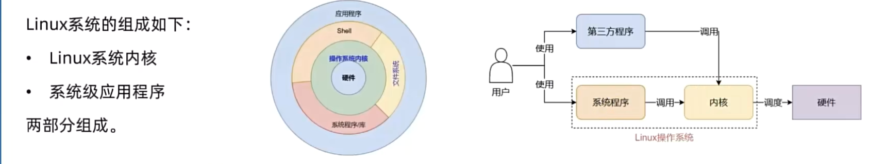
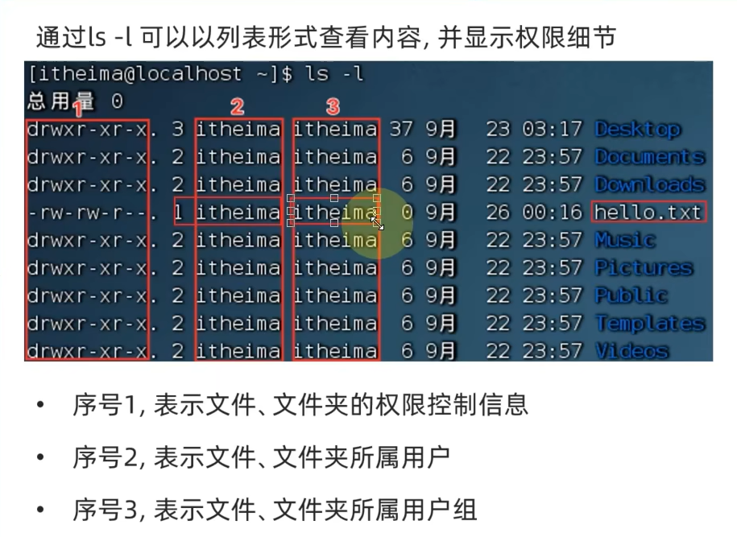
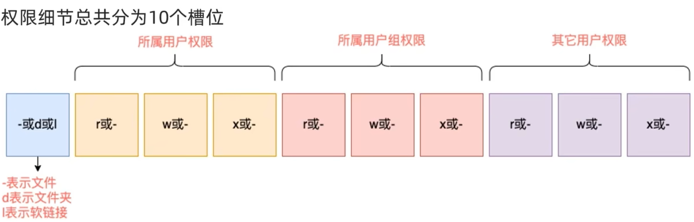
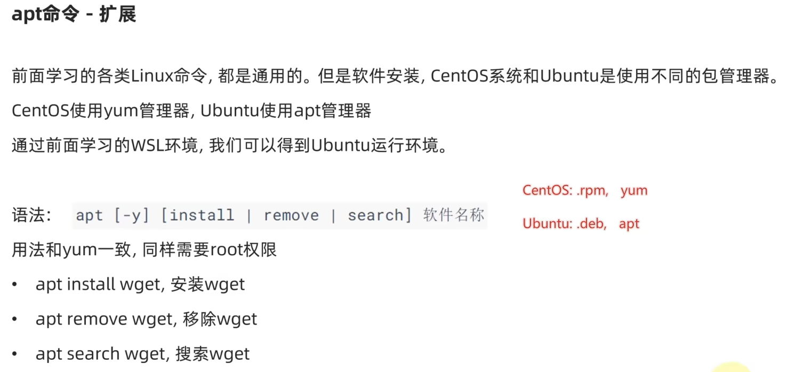
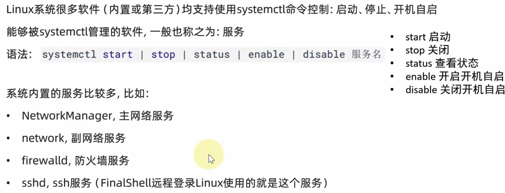
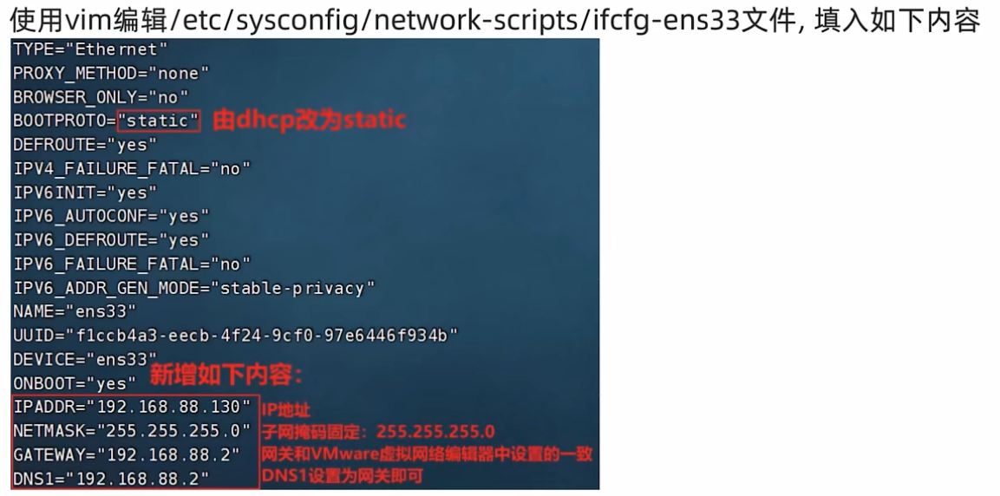
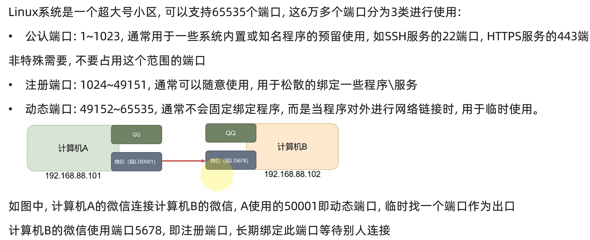
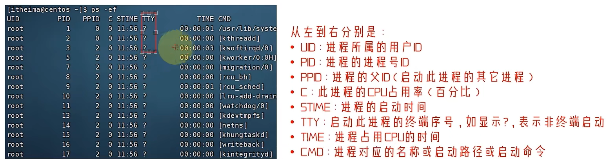
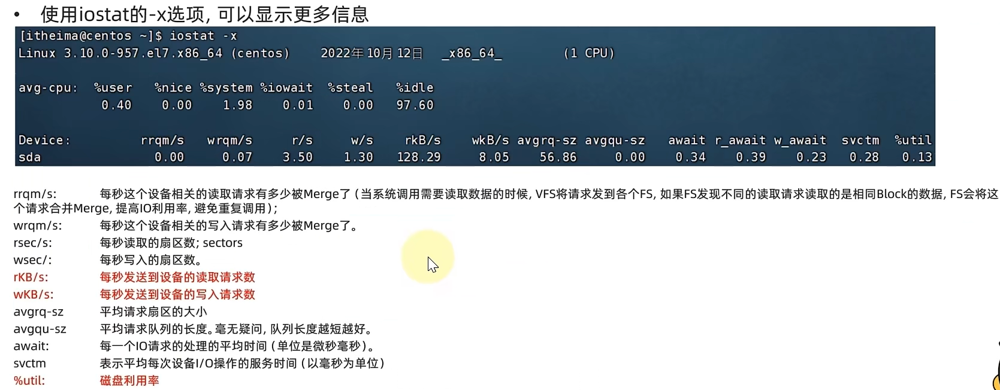
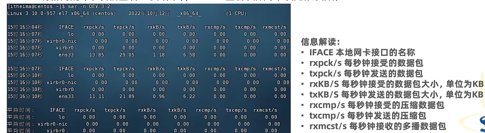

# Linux
源自:[黑马程序员新版Linux零基础快速入门到精通，全涵盖linux系统知识、常用软件环境部署、Shell脚本、云平台实践、大数据集群项目实战等](https://www.bilibili.com/video/BV1n84y1i7td)
## 一、linux基础
1. 组成:内核+系统程序

## 二、命令
### 1.目录结构
- Linux的目录是一个树形结构
- Linix没有盘符,所有的文件在根目录“/”(层级关系用‘/’)
### 2.命令
- 通用格式 : command [-options] [parameter]
#### 1. ls

|option|-|parameter|-|
|----|----|----|----|
|-a|显示所有文件(包括隐藏文件/文件夹)|-|-|
|-l|显示详细信息|-|-|
|-h|显示文件大小的单位(需要-l)|-|-|
|-|-|路径|-|

```linux
ls -l -a
ls -la
la -al
```
#### 2. cd 切换目录
#### 3. pwd 查看当前目录
#### 4. 路径

|特殊符号|-|
|----|----|
|.|当前目录|
|..|上一级目录|
|/|根目录|
|~|用户主目录(home)|
#### 5. mkdir [-p] path
- path必填
- -p创建多级目录
#### 6. touch-cat-more

|指令|-|
|----|----|
|touch path|创建文件|
|cat path|显示文件内容|
|more path|显示文件内容,支持翻页|
- more:空格翻页,q退出
#### 7. cp [-r] 源path 目的path
- 复制文件
- -r:用于复制文件夹,表示递归
#### 8. mv [-r -f]源path 目的path
- 删除文件
- -r:用于删除文件夹
- -f:强制删除
    - 只有root用户可用
    - su - root,密码:123456
    - exit 返回普通用户
#### 9. 文件查找
- '*' 为通配符
- which 命令
    - 查看命令的程序文件路径
- find path -name "文件名"
    - 在path目录下按文件名查找
- find path -size +|-n[KMG]
    - +-:表示大于小于
    - n:数字
    - KMG:单位,kb,mbb,gb
#### 10. grep [-n] "keyword" path
- 在文件里查找keyword
- -n:显示行号
#### 11. wc [] path
- 统计文件行数、单词数
- -c:统计bytes
- -m:统计字符数量
- -l:统计行
- -w:统计单词数量
#### 12. 管道符'|'
- 左边的结果作为右边的输入
#### 13. 
- 重定向符
    - \>:将命令的输出重定向到文件
    - \>\>:将命令的输出追加到文件

 
|指令|解释|
|----|----|
|echo 输出内容|直接打印内容,类似print|
|echo \` \`|``反引号内会当作指令执行,输出结果|
|echo "hello" > abc.txt|将输出结果写入文件|
|echo "hello" >> abc.txt|将输出结果追加到文件|
#### 14. tail [-f -n] path
- 查看文件最后几行
- -f:实时显示文件内容(其他程序修改了文件,仍然能跟踪到,CTRL+C退出)
- -n:显示行数,默认10行
#### 15. Vi编辑器(vim兼容vi)

- vim path
    - 文件存在，编辑文件。文件不存在，编辑新文件

|命令模式快捷键|解释|
|----|----|
|i|当前`光标位置`进入输入模式|
|a|当前`光标位置之后`进入输入模式|
|I|当前`行的开头`进入输入模式|
|A|当前`行的结尾`进入输入模式|
|o|当前`光标下一行`进入输入模式|
|O|当前`光标上一行`进入输入模式|
|键盘上下左右、hjkl|光标移动|
|0|移动光标到行首|
|$|移动光标到行尾|
|PgUp/PgDn|翻页|
|/内容|进入搜索模式|
|n、N|向下、上搜索|
|||
|dd|删除光标所在行|
|ndd|删除光标及以下n行|
|yy|复制行|
|nyy|复制n行|
|p|粘贴|
|u|撤销|
|CTRL+r|反向撤销|
|gg|移动到文件开头，第一行|
|G|移动到文件末尾，最后一行|
|dgg|当前行开始，删除到文件开头|
|dG|删除到文件末尾|
|d$|删除光标到行尾|
|d0|删除光标到行首|
|dw|删除光标所在单词|

|底线命令模式|解释|
|----|----|
|:q|退出|
|:wq|保存并退出|
|:q!|强制退出|
|:w|保存|
|:set nu|显示行号|
|:set nonu|取消行号|
|:set paste|粘贴模式，粘贴时，不会缩进|
|:set nopaste|取消粘贴模式|

## 三、Linux用户与权限
### root用户（超级管理员）
- root用户是Linux系统的最高权限用户，拥有一切权限，包括创建、删除、修改文件、目录等。
- 普通用户在home目录内不受限，其他大多数地方仅有只读和执行权限
#### su [-] [username]
- '-':加载环境变量
- 用户名:默认root
#### sudo 其他命令
- 这条命令临时赋予root权限
- 只有通过sudo认证的用户可以使用该指令
    - 切换到root用户,执行visudo命令,会自动通过vi编辑器打开: /etc/sudoers
    - 在文件后添加:`username ALL=(ALL)   NOPASSWD:ALL`
### 用户、用用户组管理
以下命令需要root用户执行
|命令|解释|
|----|----|
|groupadd 用户组名|创建用户组|
|groupdel 用户组名|删除用户组|

#### 1.创建用户
useradd [-g -d] 用户名
- -g:指定用户所属用户组，不指定则创建同名用户组
- -d:指定用户主目录，不指定则默认为/home/用户名
#### 2.删除用户
userdel [-r] 用户名
- -r:删除用户home目录,不使用-人，home目录会保留
#### 3.查看用户所在组
- id [用户名]
#### 4.修改用户所在组
- usermod -aG 用户组名 用户名
#### 5.查看系统中用户与用户组
- getent passwd
    - 结果是7份信息:
    - 用户名:密码(x):用户ID:组ID:描述信息(无用):HOME目录:执行终端(默认bash)
- getent group
    - 结果是3份信息:
    - 用户组名:组认证(X):组ID
### 权限


- 文件的rwx
    - r:读
    - w:写
    - x:执行
- 文件夹的rwx
    - r:读
    - w:可以在文件夹内增删改
    - x:可以cd引入
### chmod修改权限
#### chmod [-R] 权限 path
- -R:对文件夹内应用同样操作

示例：
- `chmod u=rwx,g=rx,0=x hello.txt` ,将文件权限修改为:rwxr-x--x
    - 其中: u表示user所属用户权限, g表示group组权限, o表示other其它用户权限
- 权限可以用3位数字代表，r记为4, w记为2, x记为1。
### chown修改所属用户、用户组
#### chown [-R] [用户名:用户组名] path
- 普通用户无法修改所属为其它用户或组,所以此命令只能由root执行
## 四、Linux使用操作
### 1.快捷键
|命令||
|-|-|
|ctrl + c|强制停止程序、终止命令输入|
|ctrl + d|退出登录、某些程序特定页面|
|history|查看命令历史(! + 命令的前几个字母，会自动匹配history)|
|ctrl + r|搜索历史命令|
|ctrl + a|光标移动到行首|
|ctrl + e|光标移动到行尾|
|ctrl + 左|光标左移一个单词|
|ctrl + 右|光标右移一个单词|
|ctrl + l|清屏，等于clear|
### 2.软件安装
yum:RPM包软件管理器,用于自动化安装配置Linux软件,并可以自动解决依赖问题。
- yum [-y] [ install | remove| search] 软件名称
    - 需要root权限
    - 需要联网


### 3.启动关闭
#### systemctl命令

### 4.软连接
将文件或文件及链接到其他位置，类似“快捷方式”。
#### ln -s [文件名] [链接名]
### 5.日期和时间
#### date [-d] [+格式化字符串]
- -d:按照给定字符串显示日期
    - 可以日期计算，如：date -d "-1 day"表示前一天
    
        时间标记 year month day hour minute second
        
|格式化||
|-|-|
|%Y |年|
|%y |年(后两位)|
|%m |月|
|%d |日|
|%H |时|
|%M |分|
|%S |秒|
|%s |时间戳,自1970年1月1日0时0分0秒起算|
#### 修改时区
- 使用root权限执行：
    ```linux
    rm -f /etc/localtime
    sudo ln -s /usr/share/zoneinfo/Asia/Shanghai /etc/localtime
    ```
#### npt程序
- 联网自动校准系统时间
```
//安装并设置开启自启动
yum -y install npt
systemctl start ntpd
systemctl enable ntpd
```
- 手动校准
```
ntpdate -u npt.aliyun.com
```
### 6.IP地址
- ifconfig:查看本机的ip地址,如无法使用`ifconfig`命令,可以安装: `yum -y install net-tools`
#### 主机名
    hostname                            //显示主机名
    hostnamectl set-hostname [主机名]   //修改主机名
#### 域名解析
- 先查看本机记录
    - Windows: C:\Windows\System32\drivers\etc\hosts
    - L inux: /etc/hosts
- 本机寻找不到在去DNS服务器查找
#### 虚拟机配置静态IP
1. 在VMware Workstation中，选择虚拟机，右键，选择虚拟机设置，选择网络，选择自定义IP，输入IP地址、子网掩码、网关、DNS服务器地址，点击确定。
2. 在Linux中配置
    
    - 执行`systemctr restart network`重启网络
### 7.网络传输
#### 网络请求和下载
- ping [-c num] ip或主机名
    - -c :检查次数
- wget [-b] url
    - -b:后台下载,日志写入wget-log
    - url :下载地址
- curl [-O] url
    - -O : 用于下载文件，不填表示网络请求
        例如：curl cip.cc //获取主机公网ip

#### 端口

可以通过`nmap`命令查看端口占用情况
- netstat -anp|grea 端口号
    - 安装netstat：yum -y install net-tools
### 8.进程管理
- 查看进程`ps [-e -f]`,一般直接使用`ps -ef`
    - -e: 显示所有进程
    - -f: 显示进程的详细信息
    
- kill [-9] 进程号
    - -9:强制杀死进程
### 9.主机状态
- 查看主机状态`top`

|命令|解释|
|----|----|
|-p|只显示某个进程|
|-d|设置刷新时间，默认5s|
|-c|显示产生进程的完整命令，默认是进程名|
|-n|指定刷新次数，如`top -n 3`,刷新3次后停止|
|-b|以非交互非全屏模式运行，以批次的方式执行top，一般配合`-n`指定输出几次统计信息，将输出重定向至指定文件，比如`top -b -n 3 > /tmp/top. tmp`|
|-i|不显示任何闲置(idle)或无用(zombie)进程|
|-u|显示指定用户进程|

- 当top以交互式运行的时候，可以用一下指令

|按键|解释|
|----|----|
|h|显示帮助画面|
|c|显示产生进程的完整命令等同于`-c`参数|
|f|选择需要展示的项目，即`列`|
|M|根据驻留内存大小(RES)排序|
|P|根据CPU使用百分比大小进行排序|
|T|根据时间/累计时间进行排序|
|E|切换顶部内存显示单位|
|e|切换进程内存显示单位|
|I|切换显示平均负载和启动时间信息|
|i|不显示闲置或无用的进程，等同于`-i`参数|
|t|切换显示CPU状态信息|
|m|切换显示内存信息|

#### 磁盘使用情况
`df [-h]`
- -h:更好的单位显示
#### 查看CPU、磁盘的相关信息
`iostat [-x] [num1] [num2]`
- -x:显示更详细的信息，包括磁盘IO、等待时间等
- num1:刷新间隔
- num2:刷新次数
    
#### 网络状态监控
过于复杂，采用固定写法：
`sar -n DEV n1 n2`
- n1:查看网络
- DEV:网络接口
- n1:刷新间隔,默认1s
- n2:刷新次数,默认无限
    
### 10.环境变量
#### `env`查看当前系统的环境变量
- 可以执行 `env | grep PATH` 查看PATH环境变量

#### linux系统使用`$`取变量值
- `echo ${Path}`,其中{}可以省略

#### 自定环境变量
- 临时，export 变量名=变量值
- 永久
    - 针对当前用户生效，配置在当前用户的: ~/.bashrc文件中
    - 针对所有用户生效，配置在系统的:/etc/profile文件中
    - 并通过语法:source配置文件，进行立刻生效,或重新登录FinalShell生效
```
在home创建自己的文件夹myenv，然后修改PATH值
export PATH=$PATH:/home/username/myenv
```
### 11.压缩、解压
#### 常用压缩格式
|格式|常用的操作系统|
|----|----|
|zip|Linux,Windows,MacOS|
|7zip|Windows|
|rar|Windows|
|tar|Linux,MacOS|
|gzip|Linux,MacOS|

#### tar 命令
- .tar,称之为tarball,归档文件,即简单的将文件组装到一个.tar的文件内,并没有太多文件体积的减少,仅仅是简单
- .gz,也常见为.tar.gz, gzip格式压缩文件,即使用gzip压缩算法将文件压缩到-一个文件内,可以极大的减少压缩后的体积

`tar [-c -v -x -f -z -C] ...`
- -c:创建压缩包
- -v:显示压缩过程
- -x:解压压缩包
- -f:指定压缩包文件名,-f 参数必须放在最后
- -z:使用gzip压缩算法,默认tarball格式
- -C:指定解压目录
##### 示例1.创建压缩包
- `tar -cvf test.tar 1.txt 2.txt 3.txt`
    - 将1.txt 2.txt 3.txt压缩到test.tar文件内
- `tar -zcvf test.tar.gz 1.txt 2.txt 3.txt`
    - 将1.txt 2.txt 3.txt压缩到test.tar.gz文件内,使用gzip模式
- `z` 一般放第一个，`f` 必须放最后
##### 示例2.解压压缩包
- tar -xvf test.tar
    - 解压test.tar,将文件解压至当前目录
- tar -xvf test.tar -C /home/itheima
    - 解压test.tar,将文件解压至指定目录( /home/itheima)
- tar -zxvf test.tar.gz -C /home/itheima
    - 以Gzip模式解压test.tar.gz,将文件解压至指定目录(/home/itheima )

#### zip 命令
`zip [-r] ...`
- -r:递归压缩

`unzip 压缩文件名 [-d] [解压目录]`
- -d:指定解压目录

## 实战
未学习