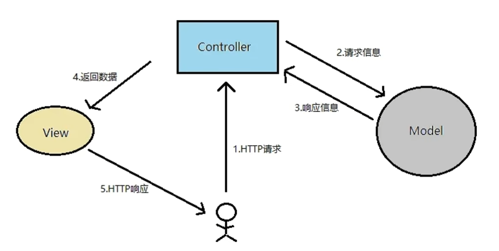
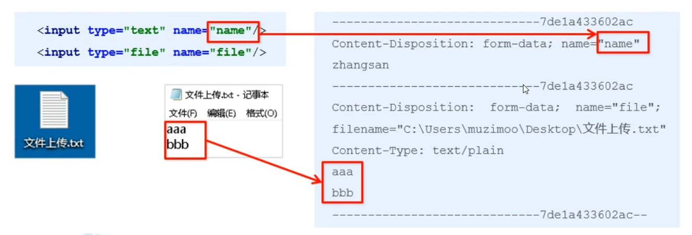
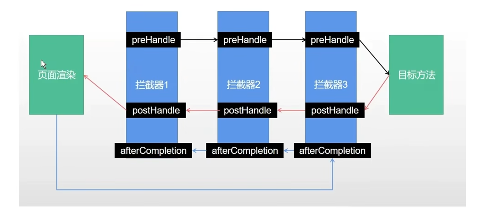
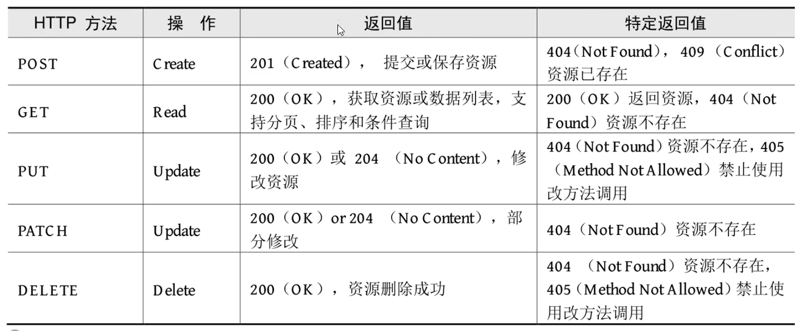

# SpringBoot
- Java EE企业级框架: SpringBoot+ MyBatisPlus
- Web前端核心框架: Vue+ ElementUI
- 公共云部署:前后端项目集成打包与部署

## 预一、Maven
`Maven`是一个项目管理工具，可以对Java项目进行自动化的构建和依赖管理。（diea内置有maven）

Maven的作用可以分成三类。
- 项目构建:提供标准的，跨平台的自动化构建项目的方式
- 依赖管理:方便快捷的管理项目依赖的资源(jar包) ，避免资源间的版本冲突等问题
- 统一开发结构:提供标准的，统- -的项目开发结构

## SpringBoot
- Spring Boot是由Pivotal团队提供的基于Spring的全新框架，旨在简化Spring应用的初始搭建和开发过程。
- Spring Boot是所有基于Spring开发项目的起点。
- Spring Boot就是尽可能地简化应用开发的门门槛，让应用开发、测试、部署变得更加简单。

### 特点
- 遵循“约定优于配置”的原则，只需要很少的配置或使用默认的配置。
- 能够使用内嵌的Tomcat、Jetty服务器， 不需要部署war文件。
- 提供定制化的启动器Starters，简化Maven配置，开箱即用。
- 纯Java配置，没有代码生成，也不需要XML配置。
- 提供了生产级的服务监控方案，如安全监控、应用监控、健康检测等。

### spring Web 依赖
```xml
<dependency>
    <groupId>org.springframework.boot</groupId>
    <artifactId>spring-boot-starter-web</artifactId>
</dependency>
```

### 配置文件 application.properties
```properties
#默认是8080
server.port=8080
```

## 预二、开发环境热部署
- Spring Boot提供了spring-boot-devtools组件,使得无须手动重启SpringBoot应用即可重新编译、启动项目，大大缩短编译启动的时间。
- devtools会监听classpath下的文件变动，触发Restart类加载器重新加载该类,从而实现类文件和属性文件的热部署。
- 并不是所有的更改都需要重启应用(如静态资源、视图模板)， 可以通过设置spring.devtools.restart.exclude属性来指定一-些文件或目录的修改不用重启应用。

1.添加依赖
```xml
<dependency>
    <groupId>org.springframework.boot</groupId>
    <artifactId>spring-boot-devtools</artifactId>
    <optional>true</optional>
</dependency>
```
2.在application.properties中配置devtools.
```properties
#热部署生效
spring.devtools.restart.enabled = true
#设置重启目录
spring.devtools.restart.additional-paths = src/main/java
#设置classpath 目录下的WEB-INF文件夹内容修改不重启
spring.devtools.restart.exclude = static/**
```

- 如果使用了Eclipse,那么在修改完代码并保存之后，项目将自动编译并触发重启，而如果使用了IntelliJ IDEA,还需要配置项目自动编译。
    - 打开Settings页面，在左边的菜单栏依次找到Build,Execution,Deployment- +Compile,勾选Build project automatically
    - 按Ctrl+ Shift+ Alt+ /快捷键调出Maintenance页面，单击Registry, 勾选compilerautomake.allow.when.app.running复选框。（新版本将此功能移动至setting-advanced-compiler内）
- 做完这两步配置之后，若开发者再次在IntelliJ IDEA中修改代码，则项目会自动重启。

## 一、SpringBoot Web入门
- Spring Boot将传统Web开发的mvc、json、 tomcat等框架整合,提供了spring-boot-starter-web组件,简化了Web应用配置。
- 创建SpringBoot项目勾选Spring Web选项后,会自动将spring-boot-starter-web组件加入到项目中。
- spring-boot-starter-web启动器主要包括web、webmvc、 json、 tomcat等基础依赖组件，作用是提供Web开发场景所需的所有底层依赖。
    - webmvc为Web开发的基础框架
    - json为JSON数据解析组件,
    - tomcat为自带的容器依赖。

```XML
<dependency>
    <groupId>org. springframework . boot</groupId>
    <artifactId>spring-boot-starter-web</artifactId>
</dependency>
```
## 二、控制器
- Spring Boot提供了@Controller和@ RestController两种注解来标识此类负责接收和处理HTTP请求。
- 如果请求的是页面和数据，使用@Controller注解即可;如果只是请求数据,则可以使用@RestController注解。


### RestController
默认情况下，@RestController注解 会将返回的对象数据转换为JSON格式。
```java
public class HelloController {

    @RequestMapping("/hello")
    public User hello(){
        User user = new User();
        user.setId(1);
        user.setName("张三");
        user.setAge(18);
        return user;
    }
}
```
### 路由映射

- @RequestMapping注解主要负责URL的路由映射。它可以添加在Controller类或者具体的方法上。
- 如果添加在Controller类上，则这个Controller中的所有路由映射都将会加上此映射规则，如果添加在方法上，则只对当前方法生效。
- @RequestMapping注解包含很多属性参数来定义HTTP的请求映射规则。常用的属性参数如下:
    - value:请求URL的路径，支持URL模板、正则表达式
    - method: HTTP请求方法
    - consumes:请求的媒体类型(Content-Type) ，如application/json
    - produces:响应的媒体类型
    - params, headers: 请求的参数及请求头的值
- @RequestMapping的value属性用于匹配URL映射，value支持简单表达式
    @RequestMapping("/user")
- @RequestMapping支持使用通配符匹配URL,用于统一映射某些URL规则类似的请求: @RequestMapping( '/getJson/*.json"),当在浏览器中请求/getJson/a.json或者/getJson/b.json时都会匹配到后台的Json方法
- @RequestMapping的通配符匹配非常简单实用，支持`*` `?` `**`
    - `*`:匹配任意字符
    - `?`:匹配一个字符
    - `**`:匹配任意路径
- 有通配符的优先级低于没有通配符的，比如/user/add.json比/user/*.json优先匹配。
- 有 `**` 通配符的优先级低于有 `*` 通配符的。

### Method匹配
HTTP请求Method有GET、POST、 PUT、DELETE等方式。HTTP支持的全部Method
- @RequestMapping注解提供了method参数指定请求的Method类型，包括RequestMethod.GET、RequestMethod.POST、 RequestMethod.DELETE、RequestMethod.PUT等值，分别对应HTTP请求的Method
```java
@RequestMapping(value = "/getData" , method = RequestMethod.GET)
public String getData(){
    return "hello";
}
```
Method匹配也可以使用@GetMapping、@PostMapping等注解代替。

### 传递参数
- @RequestParam将请求参数绑定到控制器的方法参数_上,接收的参数来自HTTP请求体或请求url的QueryString，当请求的参数名称与Controller的业务方法参数名称一致时,@RequestParam可以省略
- @PathVaraible:用来处理动态的URL，URL的值可以作为控制器中处理方法的参数
- @RequestBody接收的参数是来自requestBody中，即请求体。一般用于处理非Content-Type: application/x-www-form-urlencoded编码格式的数据。
    - 比如: `application/json`,`application/xml` 等类型的数据

```java
public String hello(String nickname){
    //访问的时候使用 http://localhost:8080/hello?nickname=张三
    return "Hello " + nickname;
}
```

#### url中参数名写错的情况
- 如果把nickname写成Name,则接收的是null

参数映射
```java
//传参是时候就要使用name
public String hello(@RequestParam("name"，required = false) String nickname){
    return "Hello " + nickname;
}

//注：如果添加了@RequestParam注解，表示name参数是必须的，否则会报错。
//如果添加了@RequestParam(required = false)，表示name参数是可选的，如果没有传递name参数，则返回null。

```

### Post请求
浏览器地址栏发送的是Get请求，而Post请求则需要使用表单或者ajax等方法发送请求。
- Post请求也可以在url里
```java
@RequestMapping(value = "/postTest3",method = RequestMethod.POST)
public String PostTest3(User user){
    System.out.print(user);
    return user.toString();
}

//如果发过来的是json格式数据
@RequestMapping(value = "/postTest4",method = RequestMethod.POST)
public String PostTest4(@RequestBody User user){
    System.out.print(user);
    return user.toString();
}
```

## 三、文件上传+拦截器
### 静态资源访问
- 使用IDEA创建Spring Boot项目，会默认创建出classpath:/static/目录, 静态资源一般放在这个目录下即可。
- 如果默认的静态资源过滤策略不能满足开发需求，也可以自定义静态资源过滤策略。
- 在application.properties中直接定义过滤规则和静态资源位置:
```properties
spring . mVC . static-path-pattern=/static/**
spring. web. resources. static-locations=classpath:/static/
```
- 过滤规则为/static/**,静态资源位置为classpath:/static/

### 文件上传
- 表单的enctype属性规定在发送到服务器之前应该如何对表单数据进行编码。
- 当表单的enctype=" application/x-www-form-urlencoded" (默认)时,form表单中的数据格式为: key=value&key=value
- 当表单的enctype= " multipart/form-data "时，其传输数据形式如下



- Spring Boot工程嵌入的tomcat限制了请求的文件大小，每个文件的配置最大为1Mb，单次请求的文件的总数不能大于10Mb。
- 要更改这个默认值需要在配置文件(如application.properties) 中加入两个配置
```properties
spring.servlet.multipart.max-file-size=10MB
spring.servlet.multipart.max-request-size=10MB
```

- 当表单的enctype= "multipart/form-data"时，可以使用MultipartFile获取上传的文件数据，再通过transferTo方法将其写入到磁盘中。
```java
//示例在idea
```
- 配置Tomcat服务器的目录
```properties
spring.web.resources.static-locations=file:D:\\oploadfile\\
```
### 拦截器
- 拦截器在Web系统中非常常见，对于某些全局统一-的操作，我们可以把它提取到拦截器中实现。总结起来，拦截器大致有以下几种使用场景:
    - 权限检查:如登录检测，进入处理程序检测是否登录，如果没有，则直接返回登录页面。
    - 性能监控:有时系统在某段时间莫名其妙很慢，可以通过拦截器在进入处理程序之前记录开始时间，在处理完后记录结束时间，从而得到该请求的处理时间
    - 通用行为:读取cookie得到用户信息并将用户对象放入请求，从而方便后续流程使用，还有提取Locale、Theme信息等，只要是多个处理程序都需要的，即可使用拦截器实现。

- Spring Boot定义了`HandlerInterceptor`接口来实现自定义拦截器的功能`HandlerInterceptor`接口定义了`preHandle`、`postHandle`、 `afterCompletion`三种方法，通过重写这三种方法实现请求前、请求后等操作



```java
public class LoginInterceptor implements HandlerInterceptor {
    /**
     *  在请求之前调用
     */
    @Override
    public boolean preHandle(HttpServletRequest request, HttpServletResponse response, Object handler) throws Exception {
//        if(true){
//            System.out.println("通过");
//            return true;
//        }else{
//            System.out.println("不通过");
//            return true;
//        }
        System.out.println("通过");
        return true;
        //return HandlerInterceptor.super.preHandle(request, response, handler);
    }
}
```

拦截器注册
- addPathPatterns方法定义拦截的地址
- excludePathPatterns定义排除某些地址不被拦截
- 添加的一个拦截器没有addPathPattern任何- 个ur则默认拦截所有请求
- 如果没有excludePathPatterns任何一个请求，则默认不放过任何一个请求。
```java
@Configuration
public class WebConfig implements WebMvcConfigurer {
    @Override
    public void addInterceptors(InterceptorRegistry registry) {
        //WebMvcConfigurer.super.addInterceptors(registry);
        registry.addInterceptor(new LoginInterceptor());
        //registry.addInterceptor(new LoginInterceptor()).addPathPatterns("/user/**");
    }
}
```
## 四、RESTful服务和Swagger

### RESTful介绍
- RESTful是目前流行的互联网软件服务架构设计风格。
- REST (Representational State Transfer, 表述性状态转移)并不是一个标准，它更像一-组客户端和服务端交互时的架构理念和设计原则，基于这种架构理念和设计原则的Web API更加简洁，更有层次。

特点:
- 每一个URI代表一种资源
- 客户端使用GET、POST、PUT、 DELETE四种表示操作方式的动词对服务端资源进行操作: 
    - GET用于获取资源
    - POST用于新建资源(也可以用于更新资源),
    - PUT用于更新资源
    - DELETE用于删除资源。
- 通过操作资源的表现形式来实现服务端请求操作。
- 资源的表现形式是JSON或者HTML。
- 客户端与服务端之间的交互在请求之间是无状态的，从客户端到服务端的每个请求都包含必需的信息。

### 构建RESTful应用接口
RESTful API 关键特征：
- `安全性`:安全的方法被期望不会产生任何副作用，当我们使用GET操作获取资源时，不会引起资源本身的改变,也不会引|起服务器状态的改变。
- `幂等性`:幂等的方法保证了重复进行一个请求和一-次请求的效果相同(并不是指响应总是相同的，而是指服务器上资源的状态从第一次请求后就不再改变了)，在数学上幂等性是指N次变换和一次变换相同。

Http Method
- HTTP提供了POST、GET、PUT、DELETE等操作类型对某个Web资源进行Create、Read、 Update和Delete操作。
- 一个HTTP请求除了利用URI标志目标资源之外，还需要通过HTTP Method指定针对该资源的操作类型，一些常见的HTTP方法及其在RESTful风格下的使用:


HTTP 状态码
- HTTP状态码就是服务向用户返回的状态码和提示信息，客户端的每一次请求,服务都必须给出回应，回应包括HTTP状态码和数据两部分。
- HTTP定义了40个标准状态码，可用于传达客户端请求的结果。状态码分为以下5个类别:

| 状态码范围 | 描述 |
|------------|------|
| 1xx        | 信息，通信传输协议级信息 |
| 2xx        | 成功，表示客户端的请求已成功接受 |
| 3xx        | 重定向，表示客户端必须执行一些其他操作才能完成其请求 |
| 4xx        | 客户端错误，此类错误状态码指向客户端 |
| 5xx        | 服务器错误，服务器负责这些错误状态码 |

SpringBoot 实现RESTful API
- Spring Boot提供的spring-boot-starter-web组件完全支持开发RESTful API,提供了与REST操作方式(GET、POST、PUT、 DELETE)对应的注解。
    - `@GetMapping`:处理GET请求，获取资源。
    - `@PostMapping`:处理POST请求，新增资源。
    - `@PutMapping`:处理PUT请求，更新资源。
    - `@DeleteMapping`:处理DELETE请求，删除资源。
    - `@PatchMapping`:处理PATCH请求，用于部分更新资源。

- 在RESTful架构中，每个网址代表一种资源， 所以URI中建议不要包含动词，只包含名词即可，而且所用的名词往往与数据库的表格名对应。

| HTTP Method | 接口地址     | 接口说明         |
|-------------|--------------|------------------|
| POST        | /user        | 创建用户         |
| GET         | /user/id     | 根据id获取用户信息 |
| PUT         | /user        | 更新用户         |
| DELETE      | /user/id     | 根据id删除对应的用户 |

```java
@RestController
public class UserController {
    @GetMapping ("/user/{id}")
    public String getUserById(@PathVariable int id){
        return "根据ID获取用户";
    }
    @PostMapping("/user")
    public String save(User user){
        return "添加用户";
    }
    @PutMapping("/user")
    public String update(User user){
        return "更新用户";
    }
    @DeLeteMapping("/user/{id}")
    public String deleteById(@PathVariable int id){
        return "根据ID删除用户";
    }
}
// 如果url为动态，应该添加@PathVariable注解
```

### 使用Swagger生成Web API文档
- Swagger是一个规范和完整的框架，用于生成、描述、调用和可视化RESTful风格的Web服务，是非常流行的API表达工具。
- Swagger能够自动生成完善的RESTful API文档，同时并根据后台代码的修改同步更新，同时提供完整的测试页面来调试API。

使用：
- 在Spring Boot项目中集成Swagger同样非常简单，只需在项目中引入springfox-swagger2和springfox-swagger-ui依赖即可。

使用固定的配置类 `SwaggerConfig`

//此写法只适用springboot 2.x
//springboot 3.x推荐使用使用springdoc-openapi来替代Swagger
对于SpringBoot 3.x版本，推荐使用springdoc-openapi来替代Swagger。配置如下：
```xml
<dependency>
    <groupId>org.springdoc</groupId>
    <artifactId>springdoc-openapi-starter-webmvc-ui</artifactId>
    <version>2.2.0</version>
</dependency>
```
在`application.yml`或`application.properties`中添加以下配置：
```yml
spring:
    mvc:
        pathmatch:
            matching-strategy: ant_path_matcher
```
然后在配置类中添加OpenAPI配置：
```java
@Configuration
public class OpenAPIConfig {
    @Bean
    public OpenAPI openAPI() {
        return new OpenAPI()
            .info(new Info().title("接口文档标题")
            .description("SpringBoot3 集成 Swagger3接口文档")
            .version("v1"))
            .externalDocs(new ExternalDocumentation()
            .description("项目API文档")
            .url("/"));
    }
}
```
启动服务后，通过浏览器访问：http://localhost:9090/swagger-ui/index.html。