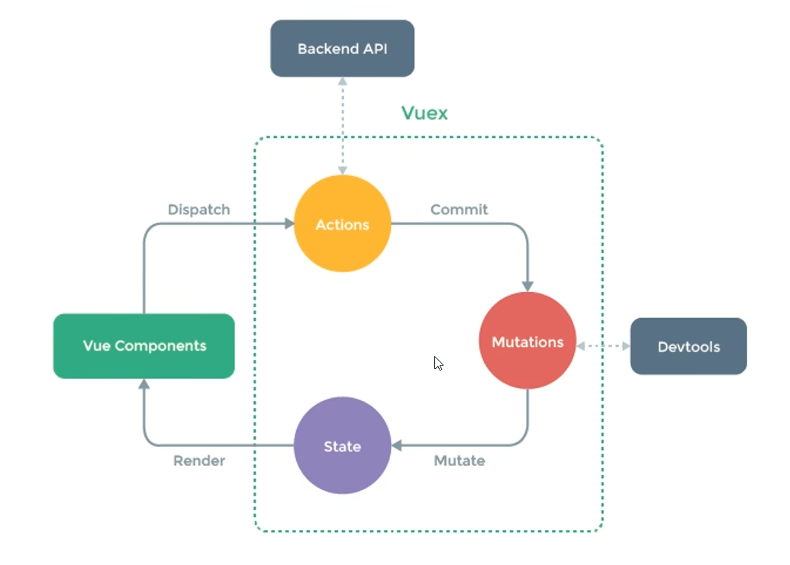

# VueX
全局状态管理器 [官网](https://v3.vuex.vuejs.org/zh/guide/)
- 作用：解决兄弟组件之间数据传递的问题
- 安装：npm install vuex@3
- vue2/3 对应 vuex3/4

## 状态管理
- 每一个Vuex应用的核心都是一个store，与与普通的全局对象不同的是，基于Vue数据与视图绑定的特点，当store中的状态发生变化时，与之绑定的视图也会被重新渲染。
- store中的状态不允许被直接修改，改变store中的状态的唯一途径就是显式地提交(commit)mutation，这可以让我们方便地跟踪每一个状态的变化。
- Vuex中有5个重要的概念:State、Getter、Mutation、Action、Module.




## 使用流程
1. 创建 store 实例
```js
// ./store/index.js
import Vue from 'vue'
import Vuex from 'vuex'

Vue.use(Vuex)

const store = new Vuex.Store({
  state: {
    count: 0
  },
  mutations: {
    increment (state) {
      state.count++
    }
  }
})

export default store
```
2. 注入 store 到根组件
```js
import store from './store'
new Vue({
  render: h => h(App),
  store
}).$mount('#app')
```
3. 使用 `{{this.$store.state.count}}` 访问